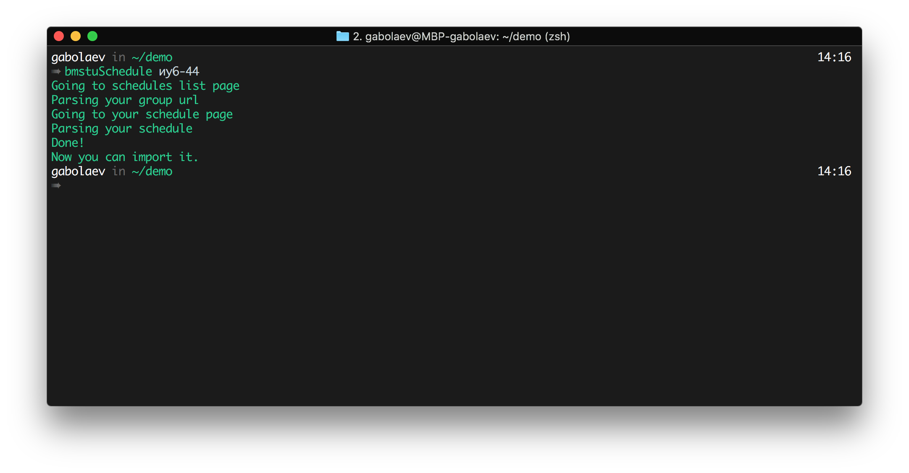
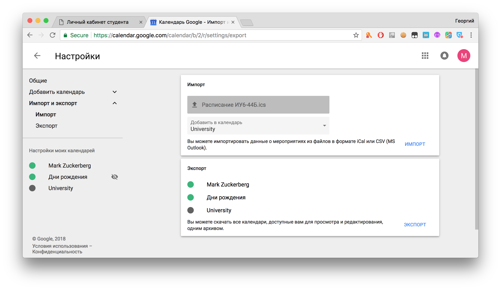
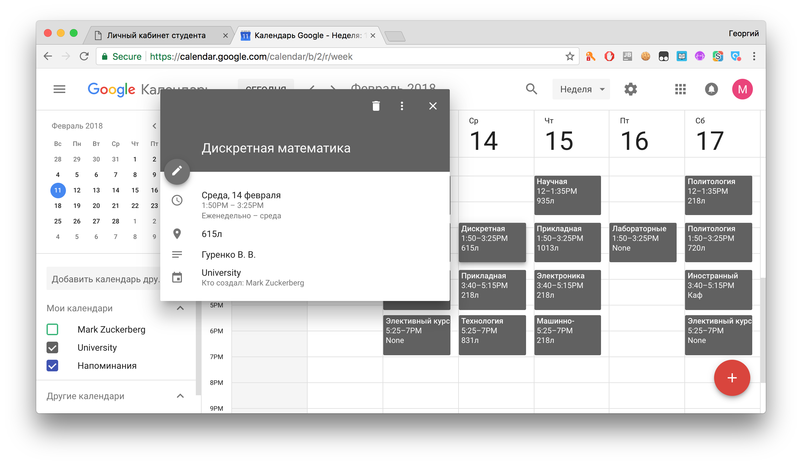

# <div align="center">BMSTU Schedule</div>
### This shit parse your EU schedule page and convert it to .ics format
#### installation:
```bash
pip3 install bmstu-schedule
```
#### How to use:
##### 1. Generate the "Расписание %YOUR_GROUP_CODE%.isc" file by passing your group code
```bash
bmstu-schedule иу6-44
```

##### 2. Open Google Calendar or macOS Calendar or any other that supports .ics import

##### 3. Import it!

