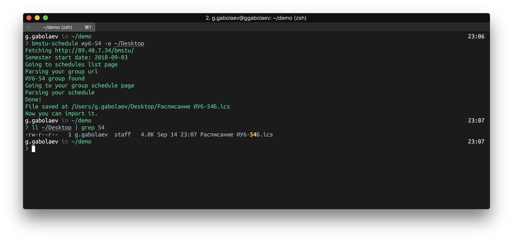

# <div align="center">BMSTU Schedule</div>
[](https://opensource.org/licenses/MIT)

### This app can parse your EU schedule page and convert it to .ics format
#### installation:
```bash
pip3 install bmstu-schedule
```
**Make sure that everything is ok with your Python bin folder and your PATH**
#### How to use:
##### 1. Generate the "Расписание %YOUR_GROUP_CODE%.isc" file by passing your group code
```bash
bmstu-schedule иу6-54
```
*If you get the "нет расписания" file, try to specify the type of group, like:
"иу6-51Б" or "иу6-51А"*

##### 2. Open Google Calendar or macOS Calendar or any other that supports .ics import

##### 3. Import it!

